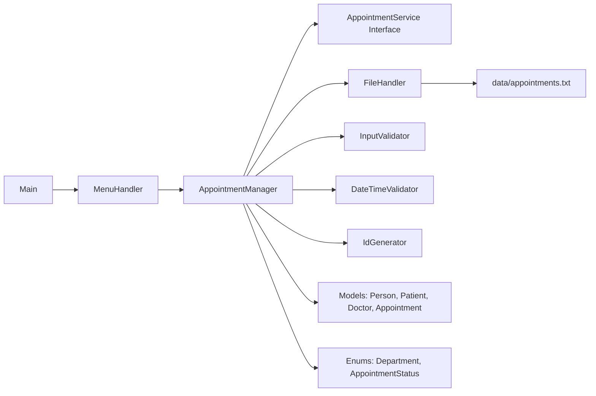

# Hospital Appointment System


A modular, console-based Java application for managing hospital appointments with strong input validation, doctor slot control, reporting, and text-file persistence.

## Table of Contents

- [Overview](#overview)
- [Key Features](#key-features)
- [Architecture](#architecture)
- [Project Structure](#project-structure)
- [Getting Started](#getting-started)
- [How to Use](#how-to-use)
- [Data Storage Format](#data-storage-format)
- [Sample Console Screenshots](#sample-console-screenshots)
- [Troubleshooting](#troubleshooting)

## Overview

This project implements a Hospital Appointment System using object-oriented design and clean separation of concerns.

It supports:

- Patient registration during appointment booking
- Doctor and department selection from a predefined list
- Time slot availability checks per doctor and date
- Appointment cancellation by ID (status update only, no hard delete)
- Search by patient name, doctor name, or date
- Automatic file save after add and cancel operations

## Key Features

- OOP requirements implemented:
  - Encapsulation with private fields and getters/setters
  - Inheritance: Patient extends Person
  - Interface-driven service contract via AppointmentService
  - Enums: Department and AppointmentStatus
- Booking safeguards:
  - No booking in past dates
  - No duplicate active slot per doctor/date/time
  - Input validation for age, date, and menu options
- Reporting:
  - Total appointments
  - Total booked
  - Total cancelled

## Architecture



## Project Structure

```text
hospital-appointment-system/
|-- data/
|   |-- appointments.txt
|-- src/
|   |-- com/hospital/appointment/
|       |-- Main.java
|       |-- enums/
|       |   |-- AppointmentStatus.java
|       |   |-- Department.java
|       |-- model/
|       |   |-- Appointment.java
|       |   |-- Doctor.java
|       |   |-- Patient.java
|       |   |-- Person.java
|       |-- service/
|       |   |-- AppointmentManager.java
|       |   |-- AppointmentService.java
|       |-- storage/
|       |   |-- FileHandler.java
|       |-- ui/
|       |   |-- MenuHandler.java
|       |-- util/
|           |-- DateTimeValidator.java
|           |-- IdGenerator.java
|           |-- InputValidator.java
|-- PROJECT_SPEC.md
|-- README.md
```

## Getting Started

### Prerequisites

- JDK 17 or newer
- Java and javac available in your PATH

### Verify Java Installation

```powershell
java -version
javac -version
```

### Build and Run (Windows PowerShell)

```powershell
if (Test-Path out) { Remove-Item -Recurse -Force out }
New-Item -ItemType Directory -Path out | Out-Null
$sources = Get-ChildItem -Path src -Recurse -Filter *.java | ForEach-Object { $_.FullName }
javac -d out $sources
java -cp out com.hospital.appointment.Main
```

### Build and Run (macOS/Linux)

```bash
mkdir -p out
javac -d out $(find src -name "*.java")
java -cp out com.hospital.appointment.Main
```

## How to Use

When the app starts, choose from the menu:

1. Add Appointment
2. View Appointments
3. Cancel Appointment
4. Search Appointment
5. View Report Summary
6. Exit

## Data Storage Format

Appointments are stored in a pipe-delimited format in data/appointments.txt.

Example:

```text
APT-2026-001|John Doe|25|Manila|D-01|Dr. Smith|CARDIOLOGY|2026-04-20|10:00|BOOKED
```

Fields:

1. Appointment ID
2. Patient Name
3. Patient Age
4. Patient Address
5. Doctor ID
6. Doctor Name
7. Department
8. Date
9. Time
10. Status

## Sample Console Screenshots

Add screenshots to docs/screenshots using the filenames below to auto-display them in this README.

| Screen               | Preview                                                        |
| -------------------- | -------------------------------------------------------------- |
| Main Menu            |                    |
| Add Appointment Flow |        |
| View Appointments    |    |
| Search Appointment   |  |
| Report Summary       |          |

## Troubleshooting

### javac is not recognized

Install JDK and make sure the JDK bin directory is in your system PATH. Reopen terminal and rerun java -version and javac -version.

### No data loaded on first run

This is normal. data/appointments.txt is created and populated after your first successful booking.

### Invalid date or menu inputs

Use date format yyyy-MM-dd and numeric menu options only.

---
